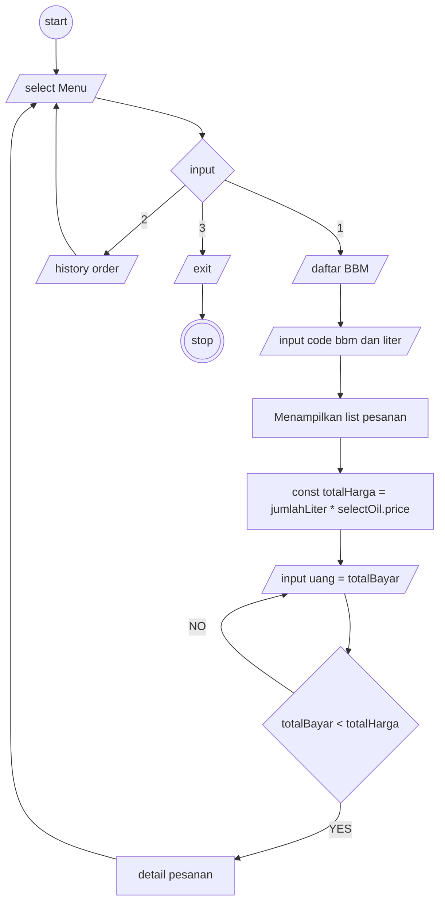

# Aplikai yang di buat untuk membeli bbm dengan mudah dan pratis dan pilihan bbm yang berfariasi
## fitur fitur yang ada :
1. Menampilkan BBM
2. Memilih BBM dan input berapa liter yang inggin di beli
3. Otomatis mengcalculasi harga yang harus di bayarkan
4. Catatan dari setiap transaksi yang terjadi

