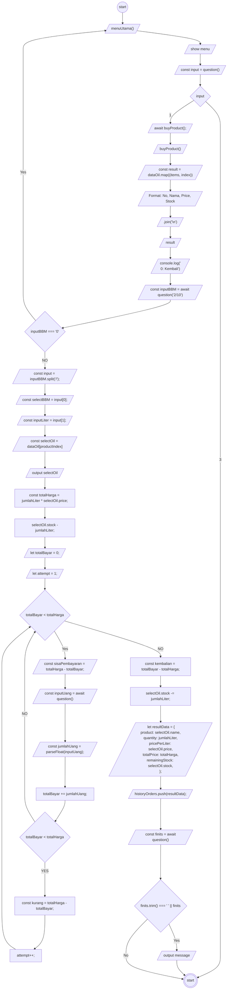

# Flowchart buy product

```mermaid
flowchart TD
a@{shape: circle, label: "start"}
b@{shape: lean-r, label: "menuUtama()"}
c@{shape: lean-r, label: "show menu"}
d@{shape: lean-r, label: " const input = question()"}
e@{shape: diam, label: "input"}
f@{shape: lean-r, label: "await buyProduct();"}
g@{shape: lean-r, label: "buyProduct()"}
h@{shape: lean-r, label: "const result = dataOil.map((items, index))"}
i@{shape: lean-r, label: "Format: No, Nama, Price, Stock"}
j@{shape: lean-r, label: ".join('\\n')"}
k@{shape: lean-r, label: "result"}
l@{shape: lean-r, label : "console.log('\n \n \n 0: Kembali')"}
m@{shape: lean-r, label : "const inputBBM = await question('2/10')"}
n@{shape: diam, label : "inputBBM === '0'"}
o@{shape: lean-r, label : "const input = inputBBM.split('/');"}
p@{shape: lean-r, label : " const selectBBM = input[0];"}
q@{shape: lean-r, label: "const inputLiter = input[1];"}
r@{shape: lean-r, label: "const selectOil = dataOil[productIndex]"}
s@{shape: lean-r, label: "output selectOil"}
t@{shape: proc, label: "const totalHarga = jumlahLiter * selectOil.price;"}
u@{shape: proc, label: " selectOil.stock - jumlahLiter;"}
v@{shape: lean-r, label : " let totalBayar = 0;"}
w@{shape: lean-r, label: "let attempt = 1;"}
x@{shape: diam, label: "totalBayar < totalHarga"}
     
y@{shape: lean-r, label: "const sisaPembayaran = totalHarga - totalBayar;"}
aa@{shape: lean-r, label: "const inputUang = await question()"}
bb@{shape : lean-r, label: "const jumlahUang = parseFloat(inputUang);"}
cc@{shape : proc, label : "totalBayar += jumlahUang;"}
dd@{shape: diam, label: "totalBayar < totalHarga"}
ee@{shape: proc, label: "const kurang = totalHarga - totalBayar;"}
ff@{shape: proc, label: "attempt++;"}
gg@{shape: proc, label: "const kembalian = totalBayar - totalHarga;"}
hh@{shape: proc, label: "selectOil.stock -= jumlahLiter;"}
ii@{shape: lean-r, label: " let resultData = {
      product: selectOil.name,
      quantity: jumlahLiter,
      pricePerLiter: selectOil.price,
      totalPrice: totalHarga,
      remainingStock: selectOil.stock,
    };"}
jj@{shape: lean-r, label: "historyOrders.push(resultData);"}
kk@{shape: lean-r, label: " const finits = await question()"}
ll@{shape: diam, label: "finits.trim() === ' ' || finits"}
mm@{shape: lean-r, label: "output message"}
z@{shape: dbl-circ, label: "start"}


a --> b
b --> c
c --> d
d --> e
e --1 --> f
e --3 --> z
f --> g
g --> h
h --> i
i --> j
j --> k
k --> l
l --> m
m --> n
n --Yes -->b
n --NO -->o
o --> p
p -->q
q --> r
r --> s
s --> t
t-->u
u-->v
v-->w
w-->x
x -- Yes -->y
y --> aa
aa --> bb
bb --> cc
cc --> dd
dd -- YES --> ee
dd -- NO --> x
ee --> ff
x -- NO --> gg
gg --> hh
hh --> ii
ii --> jj
jj --> kk
kk --> ll
ll --Yes --> mm
mm --> z
ll -- No --> z
ff --> x

```