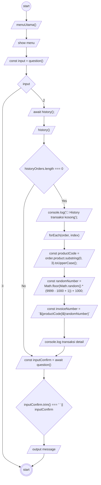

```mermaid
flowchart TD
a@{shape: circle, label: "start"}
b@{shape: lean-r, label: "menuUtama()"}
c@{shape: lean-r, label: "show menu"}
d@{shape: lean-r, label: " const input = question()"}
e@{shape: diam, label: "input"}
f@{shape: lean-r, label: "await history();"}
g@{shape: lean-r, label: "history()"}
h@{shape: diam, label: "historyOrders.length === 0"}
i@{shape: lean-r, label: "console.log('📝 History transaksi kosong');"}
j@{shape: lean-r, label: "forEach(order, index)"}
k@{shape: lean-r, label: " const productCode = order.product.substring(0, 3).toUpperCase();"}
l@{shape: lean-r, label: " const randomNumber = Math.floor(Math.random() * (9999 - 1000 + 1)) + 1000;"}
m@{shape: lean-r, label: "const invoiceNumber = `${productCode}${randomNumber}`"}
n@{shape: lean-r, label: "console.log transaksi detail"}
o@{shape: lean-r, label: "const inputConfirm = await question()"}
p@{shape: diam, label: "inputConfirm.trim() === ' ' || inputConfirm"}
q@{shape: lean-r, label : "output message"}
z@{shape: dbl-circ, label: "start"}

a --> b
b --> c
c --> d
d --> e
e -- 2 --> f
e -- 3 -->z
f --> g
g --> h
h -- Yes --> i
i --> j
j --> k
k --> l
l --> m
m ---> n
h -- No --> o
o --> p
p --> q
q --> z
n --> o

```